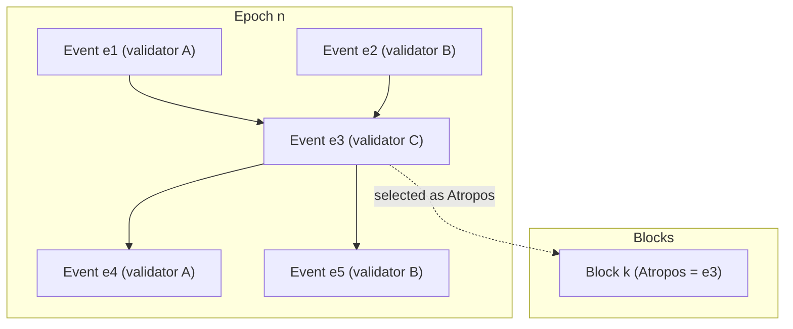

# Consensus

Consensus in a decentralized system is not just a process but a cornerstone of the system. Its mechanism guarantees a consistent and secure blockchain among all participants and ensures the system's integrity and reliability. Consensus ensures that transactions are consistently and securely validated and added to the blockchain. It's a critical element for effectively thwarting attempts by malicious actors to manipulate the network or its data. U2U uses Asynchronous Byzantine Fault Tolerance (aBFT) in combination with directed acyclic graphs to achieve consensus.

## Practical Byzantine Fault Tolerance

Practical Byzantine Fault Tolerance (PBFT) is a consensus mechanism designed to enable decentralized systems to function correctly in the presence of malicious or faulty nodes. It is named after the Byzantine generals' problem, which is an idea that illustrates the difficulties of achieving consensus in a decentralized system when some of the participants may be acting in bad faith.

In a PBFT system, nodes in a network communicate with each other to reach a consensus on the system's state, even when malicious actors are involved. To achieve this, they send messages back and forth that contain information about the system's state and the actions they propose.

Each node verifies the message it receives, and if it determines the message is valid, it sends a message to all the other nodes to indicate its agreement. In the context of cryptocurrencies, the message with which all nodes must agree is the blockchain, a ledger that stores a history of transactions.

Before the invention of cryptocurrencies, the major flaw with PBFT systems was their susceptibility to Sybil attacks. If an attacker controlled a sufficient number of nodes, they could control the entire system; there needed to be a deterrent to launch many nodes. Bitcoin first solved this problem with proof-of-work, forcing nodes to invest considerable energy to partake in the consensus.

Since then, many new solutions have been developed, such as proof-of-stake, which forces nodes to deposit tokens with monetary value, which U2U uses.

Hence, Practical Byzantine Fault Tolerance (PBFT) is a mechanism to achieve consensus. It forms a functioning decentralized system when coupled with proof-of-work or proof-of-stake to deter participants from messing with the network. However, U2U has decided to innovate on this mechanism by using Asynchronous Byzantine Fault Tolerance.

## Asynchronous Byzantine Fault Tolerance

With Asynchronous Byzantine Fault Tolerance (aBFT), nodes can reach consensus independently and are not required to exchange final blocks sequentially to confirm transactions. At the same time, they exchange event blocks, which is required to achieve consensus, and this is done asynchronously. Each node verifies transactions independently and is not required to incorporate blocks created by other validators in sequential order.

This is opposed to PBFT systems, such as Bitcoin, in which the majority of nodes must agree to a block before it becomes final, which they must then sequentially order into their blockchain record. This slows down the network during high traffic; more on this in the consensus mechanism section further below.

Now that we have a basic understanding of Byzantine fault tolerance, let's delve into the second part of U2U's consensus mechanism, directed acyclic graphs.

## Directed Acyclic Graphs

A graph is a non-linear data structure used to represent objects, called vertices, and the connections between them, called edges. A directed graph dictates that all its edges, the connections between objects, only flow in a certain direction. An acyclic graph does not contain any cycles, which makes it impossible to follow a sequence of edges and return to the starting point. As such, a directed acyclic graph (DAG) only flows in a certain direction and never repeats or cycles.

The diagram below is an example of a directed acyclic graph. Each oval is a vertex, and the lines connecting them are edges. The vertices only connect in one direction, downwards, and never repeat.

In our consensus algorithm, an event containing transactions is represented by a vertex in a DAG, and edges represent the relationships between the events. The edges may represent the dependencies between events indicating the order in which they were added to the DAG.

Events can be created and added to the DAG concurrently. The blocks do not need to be added in a specific order, which enables the system to achieve faster transaction times. It is not limited by the requirement to incorporate blocks sequentially, as is the case with many of the biggest blockchains currently available.

## U2U's Consensus Mechanism

U2U uses a proof-of-stake, DAG-based, aBFT consensus mechanism called Helios. In this mechanism, each validator has its own local event DAG and batches incoming transactions into event blocks, which they add to their DAG as vertices — each event block is a vertex in the validator's DAG that is full of transactions.

### A validator's event DAG

Before creating a new event block, a validator must first validate all transactions in its current event block and part of the ones it has received from other nodes; these are the event blocks it has received during the asynchronous exchange of event blocks explained in the section above. The new event block then is communicated with other nodes through the same asynchronous event communication.

During this communication, nodes share their own event blocks, and the ones they received from other nodes, with other validators that incorporate them in their own local DAGs. Consequently, this spreads all information through the network. The process is asynchronous as the event blocks shared between validators are not required to be sequential.

Unlike most blockchains, this DAG-based approach does not force validators to work on the current block that is being produced, which places restrictions on transaction speed and finality. Validators are free to create their own event blocks that contain transactions and share these with other validators on the network asynchronously, creating a non-linear record of transactions. This increases transaction speed and efficiency.

As an event block is sent and propagated across validators, it becomes a root event block once the majority of validators have received and agreed upon it. This root event block will eventually be ordered and included in the main chain, which is a blockchain that contains the final consensus among all event blocks that have become root event blocks.

Every validator stores and updates a copy of the main chain, which provides quick access to previous transaction history to process new event blocks more efficiently. As such, U2U's consensus mechanism combines a DAG-based approach that allows validators to confirm transactions asynchronously, which greatly increases speed, with a final blockchain that orders and stores all final transactions immutably and indefinitely.

Currently, the process of submitting a transaction and having it added to the U2U main chain through the consensus mechanism takes approximately 1-2 seconds. This involves the following steps:

1. A user submits a transaction
2. A validator node batches the transaction into a new event block
3. The event block becomes a root event block once the majority of nodes have received it
4. The root event block is ordered and finalized into the main chain as a block through the Atropos selection process

When a user explores U2U through a block explorer, they view the final blocks on the U2U main chain. Event block generation and exchange in validators' DAGs is an internal process only and is not visible to end users.

## Key Concepts

### Events

Events are the fundamental building blocks of the DAG. Each event is represented by the `Event` and `EventPayload` structures defined in `native/event.go`. An event contains:

- **Structural information**: Epoch, Lamport timestamp, Frame index, Creator validator ID, Sequence number
- **Parent references**: Links to previous events in the DAG
- **Timing data**: Creation time and median time across validators
- **Gas accounting**: Gas power left and gas power used
- **Payload**: Transactions, block votes, epoch votes, or misbehaviour proofs

Events are serialized using a compact format defined in `native/event_serializer.go`, which efficiently encodes parent relationships using Lamport time differences.

### Frames

Frames are logical time buckets within an epoch. They are encoded in each event's `Frame` field and used by the Helios ordering algorithm to detect when enough validators have observed certain events. Frames enable the system to progress through logical rounds without requiring strict synchronization.

### Roots

A root is an event that has reached enough validators in the DAG to serve as a synchronization point. Root detection is performed by the upstream Helios DAG engine (from `go-helios`). Roots form the backbone used to derive Clotho and Atropos events, which ultimately determine block boundaries.

### Epochs

An epoch is a period during which a consistent validator set and economic rules apply. Epoch state is tracked in `native/iblockproc/decided_state.go` through the `EpochState` structure, which includes:

- Epoch number and start times
- Validator set and their profiles
- Economic rules (gas limits, prices, etc.)
- Per-validator epoch state

Epochs are sealed when either the maximum epoch gas (`MaxEpochGas`) or maximum epoch duration (`MaxEpochDuration`) is reached, as defined in `u2u/rules.go`.

### Atropos

An Atropos is a root event that has been fully finalized by the Helios algorithm. Each Atropos event anchors a linear block in the main chain. The Atropos selection process ensures that all validators agree on which events should be included in each block, providing finality and consistency across the network.

## Life of a Transaction

A transaction on the U2U network goes through several stages during its life cycle:

### Submission

Users submit transactions through the standard Ethereum-compatible RPC API, which is handled by `ethapi/api.go` and `ethapi/backend.go`. Transactions enter the transaction pool, where they await inclusion in an event block.

### Event Creation

Validators run an emitter process (configured in `gossip/emitter/*`) that selects transactions from the pool and packages them into event blocks. The emitter respects gas power allocation rules defined in `u2u/rules.go` to ensure fair resource distribution among validators.

### Gossip and DAG Propagation

Event blocks are propagated across the network using the U2U sub-protocol defined in `gossip/protocol.go`. Validators receive event hashes and full event payloads, validate them through multiple checkers (`eventcheck/*`), and incorporate valid events into their local DAGs.

### Consensus and Ordering

The Helios DAG engine (from `go-helios`) processes the DAG to determine which events should become roots, Clotho, and ultimately Atropos events. This ordering process is asynchronous and does not require validators to wait for sequential block production.

### Block Finalization

When an Atropos event is decided, the consensus engine calls back into the block processing logic (`gossip/c_block_callbacks.go`). The system:

1. Collects all confirmed events associated with the Atropos
2. Executes transactions through the EVM
3. Updates both EVM state and SFC (staking) state
4. Creates a final block that is persisted to storage

### Finality

Once an event becomes an Atropos and its block is finalized, the transaction has reached finality. All validators agree on the block's contents, and the transaction cannot be reverted without violating the aBFT assumptions. This provides strong finality guarantees while maintaining high throughput through asynchronous processing.

For a more technical understanding of U2U's consensus mechanism, refer to the Helios documentation and the implementation details in the codebase, particularly in `gossip/handler.go`, `gossip/c_block_callbacks.go`, and `native/iblockproc/decided_state.go`.

